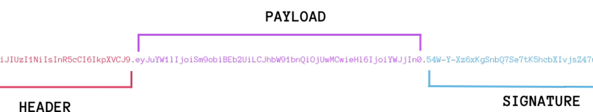
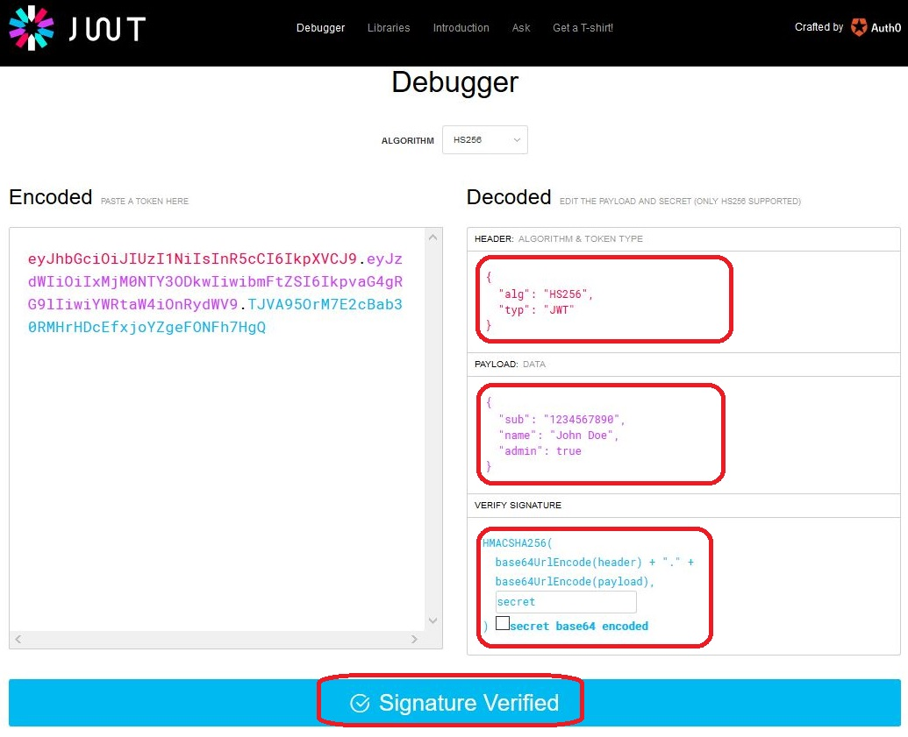
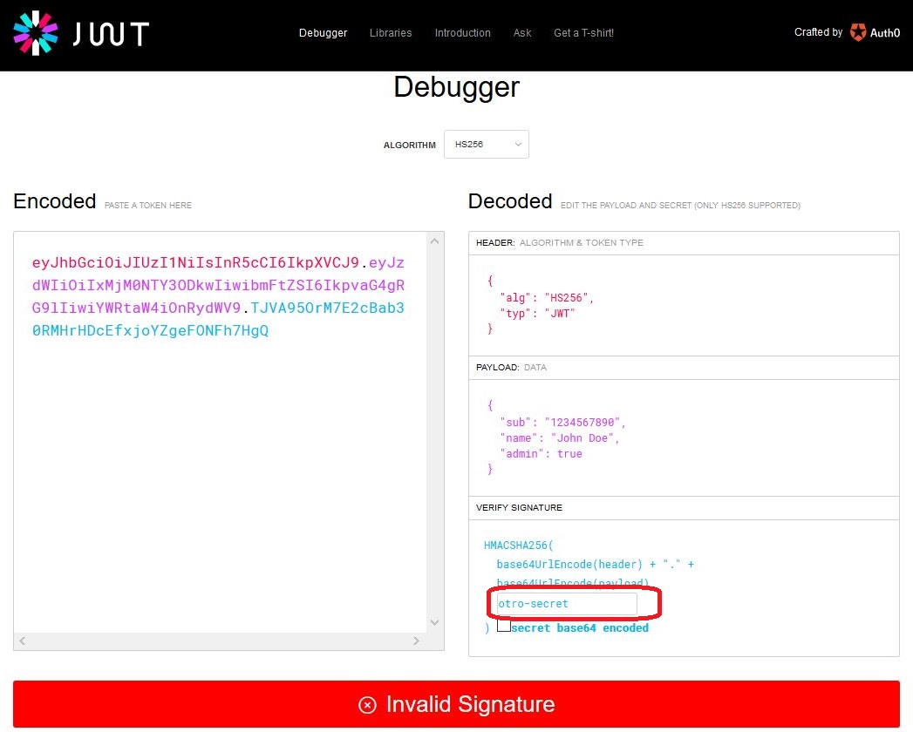
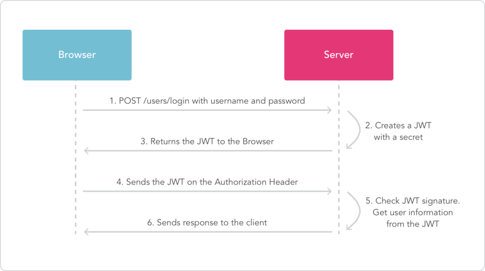
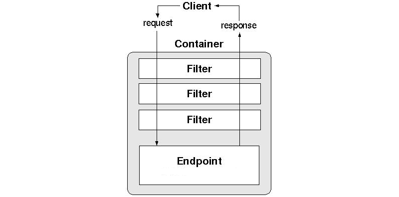

# Ejemplo de implementación de la seguridad Json Web Token con Spring Boot y Kotlin


## 1. Json Web Token

**¿Qué es un JSON Web Token?**

JWT es un estándar RFC 7519 para transmitir información con la identidad y _claims_ de un usuario de forma segura entre un cliente/servidor. Dicha información puede ser verificada y confiable porque está firmada digitalmente.

Como siempre, estas definiciones, cuando hablamos de conceptos técnicos son muy ambiguas y confunden más que ayuda a entenderlo.

A mi me gusta ir directo al grano, un JWT es "simplemente" una cadena de texto que tiene 3 partes codificadas en Base64, separadas por un punto (header.payload.firma) que generamos y entregamos a los clientes de nuestra API:



> La codificación **Base64** se llama así porque genera una cadena ascii para representar cualquier dato binario, usando para ello un alfabeto de 64 caracteres. La versión URL elimina del alfabeto los caracteres “=”, “/” y “+”.

Es importante aclarar que la cadena/token esta codificado y lo crea nuestra aplicación, esto nos permite de manera muy fácil inspeccionar su contenido, por ejemplo con: [JWT Debugger](https://jwt.io/).

Por ejemplo, si usamos el siguiente token:

```jwt
eyJhbGciOiJIUzI1NiIsInR5cCI6IkpXVCJ9. eyJzdWIiOiIxMjM0NTY3ODkwIiwibmFtZSI6IkpvaG4gRG9lIiwiYWRtaW4iOnRydWV9. TJVA95OrM7E2cBab30RMHrHDcEfxjoYZgeFONFh7HgQ
```

en JWT Debugger, obtenemos el siguiente resultado:



**Pero, puedo ver el contenido. ¿Esto es seguro?**

Esta es la pregunta que todos nos hacemos la primera vez, hemos dicho que un JWT tiene 3 partes y esta codificado en Base64. Vamos a verlo:

- `HEADER`: `eyJhbGciOiJIUzI1NiIsInR5cCI6IkpXVCJ9`: Indica el algoritmo y tipo de Token, en nuestro caso: `HS256` y `JWT`.
- `PAYLOAD`: `eyJzdWIiOiIxMjM0NTY3ODkwIiwibmFtZSI6IkpvaG4gRG9lIiwiYWRtaW4iOnRydWV9`: datos de usuario/_claims_, fecha creación/caducidad Token y lo que necesite nuestra API para validar la petición. El estándar define unos cuantos posibles:
    - `sub`: identificador del usuario
    - `iat`: timestamp del momento de creación.
    - `exp`: timestamp en segundos a partir del cual el token dejará de ser válido. Es importante, desde el punto de vista de la seguridad, generar tokens con caducidad.
> En el payload podemos incluir campos personalizados, aquellos que usemos frecuentemente y nos ahorren peticiones contra la base de datos por ejemplo. Uno típico podría ser el nivel de privilegios que tiene el usuario. La “necesidad” es usar https es obvia, ya que el payload (datos sensibles), está simplemente codificado en base64 y cualquiera que intercepte el token podrá ver su contenido.
- `SIGNATURE`: `TJVA95OrM7E2cBab30RMHrHDcEfxjoYZgeFONFh7HgQ` (la firma, para verificar que el token es válido, aqui lo importante es el **"secret"** con el que firmamos y que ahora explicaremos).

Asi que la respuesta es: "Sí, es totalmente seguro", porque como vemos en la imagen anterior, se indica **"Signature Verified"**: esto quiere decir que la firma se usa para verificar que el remitente del JWT es quien dice ser y para asegurarse de que el mensaje no haya cambiado en el camino.

Expliquemos con algo más de detalle la firma. Como decíamos al principio, *"la información puede ser verificada y confiable porque está firmada digitalmente"*, con un `secret-key`. Lo importante aquí es el `secret-key` para generar la firma del token, por supuesto, no hace falta decir que nuestro `secret-key` nunca se lo daremos a nadie.

Veamos el ejemplo en el JWT Debugger cambiando "`secret`" por "`otro-secret`" en el editor y pasará lo que se muestra en la imagen.



En este caso, al cambiar el "secret-key", vemos que la firma no es válida "Invalid Signature". Esto quiere decir que no podemos confiar en el Token JWT, porque que alguien lo puede haber firmado de forma maliciosa o cambiado algo del payload.

Por supuesto, será responsibilidad de nuestra aplicación cuando recibamos un Token en nuestra API, verificarlo con nuestro "secret-key", garantizar que la firma es válida para aceptarlo o denegarlo y eso lo tenemos que programar o usar alguna libreria ya disponible.

A nivel de algoritmos, podemos utilizar los siguientes con JWT:


- `HS256`: El el algoritmo usado por defecto, que consiste en un cifrado de clave simétrica HMAC (necesita una clave o SECRET para realizar el cifrado) con el algoritmo de hash SHA-256 (que produce una salida de 256 bits).
- `HS512`: cifrado de clave simétrica HMAC (necesita una clave o SECRET para realizar el cifrado) con el algoritmo de hash SHA-512 (que produce una salida de 512 bits).
- `RS256`: cifrado de clave simétrica RSASSA-PKCS1-v1_5 con el algoritmo de hash SHA-256. NOTA: Los cifrados asimétricos son interesantes en aplicaciones desacopladas, donde podemos tener la clave privada en el servidor y la clave pública en el cliente, por ejemplo.
- `RS512`: cifrado de clave asimétrica RSASSA-PKCS1-v1_5 con el algoritmo de hash SHA-512.
- `PS256`: cifrado de clave asimétrica RSASSA-PSS con el algoritmo de hash SHA-256. Este es el reemplazo de RSA-PKCS
- `PS512`: cifrado de clave asimétrica RSASSA-PSS con el algoritmo de hash SHA-512.
- `ES256`: cifrado de clave asimétrica ECDSA con el algoritmo de hash SHA-256. ECDSA utiliza claves más pequeñas y es más eficiente que RSA, Actualmente es el algoritmo que usan las criptomonedas Bitcoin y Ethereum, por ejemplo.
- `ES512`: cifrado de clave asimétrica ECDSA con el algoritmo de hash SHA-512.

> SHA significa **Secure Hash Algorithm** y a día de hoy SHA256 y SHA512 (Ambos de la familia SHA-2), siguen sin ser quebrantados, a diferencia de SHA-1. Además ya existe SHA-3, que sigue un enfoque diferente a la anterior versión y que aún no se sabe si es mejor ni si será su reemplazo en el futuro.

Si queremos información más técnica y detallada, leer esto: https://jwt.io/introduction


### 1.1 Ciclo de vida de un Token

Ahora que ya sabemos qué es JWT, vamos a dar un paso más allá y a conocer como funciona el proceso completo con un diagrama de uso:



El proceso completo del JWT consta de estos pasos:

1. El usuario de una aplicacion web/móvil/desktop hace login con sus credenciales en el servidor donde esta publicada el API.
2. El usuario es validado en el servidor y se crea un nuevo Token JWT (usando nuestro "secret-key") para entregárselo al usuario.
3. El servidor retorna el JWT firmado que contiene los datos/claims referentes al usuario y caducidad del Token.
4. El cliente/browser almacena el JWT para su uso y lo envia en cada petición mediante "Authorization: Bearer ".
5. El servidor verifica la firma del Token, su caducidad y comprueba si usuario tiene permisos al recurso leyendo los datos del payload.
6. El servidor responde al cliente la petición una vez ha confirmado el Token y los permisos del usuario son correctos.

Comentarios sobre el ciclo de vida del JWT:

- `"Authorization: Bearer "`, es la forma más común, indicar que existen otras técnicas para hacerlo.
- JWT es muy ligero: podemos codificar gran cantidad de datos sensibles en el payload y pasarlo como una cadena.
- Creamos servicios de autenticación optimizados desacoplados del servidor y tenemos protección contra ataques CSRF.
- Nos ahorramos mantener el estado del usuario en el servidor y lo delegamos al cliente.
- Recordar que siempre, siempre, siempre debemos usar HTTPS entre el cliente/servidor para las peticiones.
- Y lo más importante: ¡Nos olvidamos de cookies!

> Los ataques CSRF realizan peticiones falseadas desde un servidor a otro de forma oculta dentro del html, que ha sido manipulado para ello. De modo que no es necesario robar la cookie para poder llevar a cabo acciones sobre el backend usando los privilegios del propietario de la misma.

Observando el ciclo de vida de JWT, vemos que la ventaja fundamental de este modelo de seguridad, es que, en lugar de almacenar información relacionada con la autorización vinculada a cada usuario en sesión del servidor, se almacena una sola clave de firma ("secret-key") en el servidor que sirve para crear los Tokens.

### 1.2 Token de refresco

Adicionalmente al uso de tokens de autenticación, podemos usar un segundo token, cuya fecha de expiración sea mayor. Este token sirve para que, una vez caducado el token de autenticación, podamos obtener uno nuevo, sin tener que recurrir a realizar la petición de login. El token de refresco no debe de poder utilizarse para otro tipo de peticiones.


## 2. Implementación con Spring Security

Como sabemos, Spring Security es un framework de seguridad para aplicaciones Java que nos permite implementar las dos grandes operaciones relacionadas con la seguridad web: la autenticación y la autorización.

- La autenticación permite que un usuario pueda demostrar quién es.
- La autorización permite que, una vez identificado quién es el usuario, podamos determinar qué puede hacer y qué no.

### 2.1 Filtros

Spring Security no implementa por defecto la seguridad JWT, y por tanto la tenemos que implementar a través de un **filtro**. Los filtros vienen desde el _mundo_ Java. Son clases que nos permiten interceptar una petición y modificarla antes de que sea procesada por el Servlet/Controlador, o interceptar una respuesta antes que que la misma sea enviada al cliente. Para crear estas clases es necesario implementar la interface `javax.servlet.Filter` (o alguno de sus derivados), la cual define los siguientes tres métodos que debemos implementar:

- `init(cfg: FilterConfig)`. Es invocado una vez que el filtro entra en funcionamiento.
- `destroy()`. Este método se llama cuando el filtro deja de funcionar.
- `doFilter(req: ServletRequest, res: ServletResponse, chain: FilterChain)`. Se llama a este método para cada petición correlacionada con este filtro antes de invocar el Servlet/Controlador. El Servlet/Controlador original solicitado se ejecuta cuando el filtro llama al método `chain.doFilter(...)`.



### 2.2 Filtros de Spring Security

La Infraestructura Web de Spring Security esta basada enteramente en Filtros. Spring Security mantiene una cadena de filtros internamente, donde cada uno de estos filtros cumple un responsabilidad particular y los filtros son agregados o borrados de la configuración de acuerdo  a los servicios requeridos, el orden de los filtros es importante pues hay dependencias entre ellos.

Uno de los filtros configurados por defecto en esta cadena es `UsernamePasswordAuthenticationFilter`. Se encarga de procesar las peticiones de autenticación desde un formulario con usuario y contraseña. A la hora de implementar la seguridad con los filtros de seguridad para JWT, colocaremos nuestro filtro JWT antes de este `UsernamePasswordAuthenticationFilter`, de forma que no requiera de un usuario y contraseña para poder autenticarse. Veremos como hacerlo en la clase que configura la seguridad.

## 3. Arquitectura de la seguridad JWT con Spring Boot y Spring Security.

Para implementar la seguridad JWT con Spring Security vamos a comenzar creando la clase que gestione la seguridad, que como siempre, extenderá a `WebSecurityConfigurerAdapter` e irá anotada con `@EnableWebSecurity`.

```kotlin
@Configuration
@EnableWebSecurity
@EnableGlobalMethodSecurity(prePostEnabled = true)
class WebSecurityConfiguration(
        
) : WebSecurityConfigurerAdapter() {

}
```

Ahora, conforme vayamos sobrescribiendo los métodos de nuestra clase base, vamos a ir viendo otras clases o beans que tenemos que implementar.

### 3.1 Clase para modelar a un usuario

La primera que se nos viene a la mente es nuestra clase usuario. Debe ser una clase que implemente la intefaz `UserDetails` definida en Spring Security, para hacerla compatible con el resto del framework de autenticación:

```kotlin
@Entity
class User(

        @Column(nullable = false, unique = true)
        private var username: String,

        private var password: String,

        var fullName : String,

        @ElementCollection(fetch = FetchType.EAGER)
        val roles: MutableSet<String> = HashSet(),

        private val nonExpired: Boolean = true,

        private val nonLocked: Boolean = true,

        private val enabled: Boolean = true,

        private val credentialsNonExpired : Boolean = true,

        @Id @GeneratedValue val id : UUID? = null


) : UserDetails {

    constructor(username: String, password: String, fullName: String, role: String) :
            this(username, password, fullName, mutableSetOf(role), true, true, true, true)

    override fun getAuthorities(): MutableCollection<out GrantedAuthority> =
            roles.map { SimpleGrantedAuthority("ROLE_$it") }.toMutableList()

    override fun isEnabled() = enabled
    override fun getUsername() = username
    override fun isCredentialsNonExpired() = credentialsNonExpired
    override fun getPassword() = password
    override fun isAccountNonExpired() = nonExpired
    override fun isAccountNonLocked() = nonLocked


    /**
     * En JPA, dos entidades deberían considerarse iguales
     * sí tienen en mismo ID
     */

    override fun equals(other: Any?): Boolean {
        if (this === other)
            return true
        if (other === null || other !is User)
            return false
        if (this::class != other::class)
            return false
        return id == other.id
    }

    override fun hashCode(): Int {
        if (id == null)
            return super.hashCode()
        return id.hashCode()
    }
}

```

> En esta implementación se ha decidido usar el tipo `UUID` como identificador, aunque se podría sustituir por `Long`. Puedes visitar el siguiente enlace para tener más información sobre UUID: [https://www.baeldung.com/java-uuid](https://www.baeldung.com/java-uuid)


> La implementación de los roles es algo ineficiente en el código anterior, debido al uso de la anotación `@ElementCollection`. Sería adecuado buscar otra implementación, ya sea a través de asociaciones `@OneToMany`-`@ManyToOne` o, por ejemplo, a través de un _Attribute Converter_ para almacenarla como una lista separada por comas en una cadena de caracteres.

Acompañanado a esta entidad, tendremos el correspondiente repositorio y servicio:

```kotlin
interface UserRepository : JpaRepository<User, UUID> {

    fun findByUsername(username : String) : Optional<User>

}

class UserService(
        private val repo: UserRepository,
        private val encoder: PasswordEncoder
) {

    fun create(newUser : CreateUserDTO): Optional<User> {
        if (findByUsername(newUser.username).isPresent)
            return Optional.empty()
        return Optional.of(
                with(newUser) {
                    repo.save(User(username, encoder.encode(password), fullName, "USER"))
                }

        )
    }

    fun findByUsername(username : String) = repo.findByUsername(username)

    fun findById(id : UUID) = repo.findById(id)

}

```

### 3.2 `UserDetailsService`

Spring Security nos permite definir diferentes mecanismos de autenticación:

- Almacenando los datos en memoria
- En un servidor ldap, como el _Active Directory_ de Windows
- En una base de datos que se accederá a través de JDBC
- Definiendo un servicio que nos devuelva, a través de _algún mecanismo_, una instancia de `UserDetails`.

Nosotros escogemos el último mecanismo, más adecuado para integrar con Spring Data JPA.

Necesitamos definir entonces una clase que extienda a `UserDetailsService` e implemente el único método que define esta interfaz:

```kotlin
@Service("userDetailsService")
class UserDetailsServiceImpl(
        private val userService: UserService
) : UserDetailsService {


    override fun loadUserByUsername(username: String): UserDetails =
            userService.findByUsername(username).orElseThrow {
                UsernameNotFoundException("Usuario $username no encontrado")
            }
}
```

### 3.3 Retomamos nuestra clase `WebSecurityConfiguration`

Una vez definidas algunas de las clases anterior, podemos comenzar a dar cuerpo a algunos métodos de la clase de configuración de seguridad.

Antes, tenemos que definir el mecanismo mediante el cuál vamos a cifrar nuestra contraseña, para que no se guarde en la base de datos como texto plano. Para ello, creamos un bean de tipo `PasswordEncoder`, usando el algoritmo _bcrypt_.

```kotlin
@Configuration
class ConfigurePasswordEncoder() {

    @Bean
    fun passwordEncoder() : PasswordEncoder = BCryptPasswordEncoder()

}
```

Una vez que lo hemos definido, podemos implementar algunos métodos de `WebSecurityConfiguration`: 


```kotlin
@Configuration
@EnableWebSecurity
@EnableGlobalMethodSecurity(prePostEnabled = true)
class WebSecurityConfiguration(
        private val userDetailsService: UserDetailsService,
        private val passwordEncoder: PasswordEncoder
) : WebSecurityConfigurerAdapter() {

    override fun configure(auth: AuthenticationManagerBuilder) {
        auth.userDetailsService(userDetailsService).passwordEncoder(passwordEncoder)
    }

    

    @Bean
    override fun authenticationManagerBean(): AuthenticationManager {
        return super.authenticationManagerBean()
    }


}

```

> Nótese que estamos inyectando los beans de tipo `UserDetailsService` y `PasswordEncoder` a través del constructor.

El primer método define cuál va a ser el esquema de autenticación (a través de nuestro `UserDetailsService`), y el segundo expone el esquema de autenticación como un bean, para poder realizar dicha autenticación programáticamente.

### 3.4 Método que implementa la autorización

En la clase  `WebSecurityConfiguration` nos falta sobrescribir un método fundamental, `fun configure(http: HttpSecurity)`, que sirve para definir la autorización y terminar de configurar la seguridad. Vamos a ir implementándolo poco a poco, ya que requerirá de que demos implementación a algunos beans más.

```kotlin
   override fun configure(http: HttpSecurity) {
        // @formatter:off
        http
                .csrf().disable()
                .exceptionHandling().authenticationEntryPoint(...)
                .and()
                .sessionManagement().sessionCreationPolicy(SessionCreationPolicy.STATELESS)
                .and()
                .authorizeRequests()
                    ...

        // Este filtro es el que realiza la autenticación a través de token
        http.addFilterBefore(..., UsernamePasswordAuthenticationFilter::class.java)

        // Para la consola de H2
        http.headers().frameOptions().disable()

        // @formatter:on
    }

```

Podemos observar lo siguiente:

- Se deshabilita la seguridad csrf. Es un problema normalmente asociado al uso de sesiones, en nuestro caso no las vamos a usar, ya que la sesión reside en el token que tendrá el cliente.
- Tenemos que definir un bean para setear como _authenticationEntryPoint_.
- Indicamos que la política de sesiones es no crear sesiones.
- Autorizamos determinadas peticiones que más adelante trabajaremos
- Vamos a necesitar añadir un filtro, que se encargará de la autenticación basada en token.
- Configuramos lo necesario para poder acceder a la consola de h2

Por tanto, por ahora vamos a necesitar definir:

- Un _Authentication Entry Point_
- Un filtro para la autenticación JWT.


### 3.5 `AuthenticationEntryPoint`.

Según la documentación de Spring, las clases que implementan la interfaz `AuthenticationEntryPoint` son las que definen el reino de seguridad y son invocadas cuando hay algún problema de autenticación.

En nuestro caso, vamos a realizar una implementación simple, que devuelve JSON sencillo con un código de respuesta 401 cuando haya algún problema de autenticación. Nos basaremos en la interfaz `AuthenticationEntryPoint`:

```kotlin
@Component
class JwtAuthenticationEntryPoint(
        val mapper : ObjectMapper
)  : AuthenticationEntryPoint {


    override fun commence(request: HttpServletRequest?, response: HttpServletResponse?, authException: AuthenticationException?) {

        response?.status = 401
        response?.contentType = "application/json"

        response?.writer?.println(mapper.writeValueAsString(authException?.message?.let { MensajeError(it) }))

    }

}

data class MensajeError(
    val mensaje: String
)
```

En caso de error en la autenticación, devolvemos un JSON sencillo con el mensaje de la excepción, y código de respuesta 401.

> En este punto, sería bueno utilizar el manejo de errores del proyecto `ejemplo-validación` disponible en el repositorio de la asignatura.


## 4. Código necesario para usar JWT

En el apartado anterior nos hemos quedado pendientes, para culminar con la seguridad, de implementar un filtro que realice la autenticación con JWT. Para ello, necesitaremos implementar algunas clases más, a la sazón:

- Un componente que nos permita trabajar con tokens, pudiendo _fabricarlos_ o _verificarlos_
- El filtro en sí
- Un controlador que permita realizar las peticiones de autenticación y refresco de token
- Algunas clases DTO adicionales para las operaciones anteriores.

Spring no provee de ninguna clase _nativa_ para trabajar con tokens JWT, por lo que necesitamos añadir alguna dependencia auxiliar, como:

```xml
<dependency>
	<groupId>io.jsonwebtoken</groupId>
	<artifactId>jjwt-api</artifactId>
	<version>0.11.1</version>
</dependency>
<dependency>
	<groupId>io.jsonwebtoken</groupId>
	<artifactId>jjwt-impl</artifactId>
	<version>0.11.1</version>
	<scope>runtime</scope>
</dependency>
<dependency>
	<groupId>io.jsonwebtoken</groupId>
	<artifactId>jjwt-jackson</artifactId>
	<version>0.11.1</version>
	<scope>runtime</scope>
</dependency>
```

> En mvnrepository puedes encontrar fácilmente estas dependencias para gradle, si es que estás trabajando con él.


### 4.1 Proveedor de tokens

La primera clase que vamos a implementar tendrá muchos métodos diferentes. La vamos a definir como un componente, aunque posiblemente podría haber estar anotada como servicio (o al menos, con algún conjunto de sus métodos)


```kotlin
@Component
class JwtTokenProvider {

    // Algunas constantes de utilidad
    companion object {
        const val TOKEN_HEADER = "Authorization"
        const val TOKEN_PREFIX = "Bearer "
        const val TOKEN_TYPE = "JWT"
    }

    // Algunos de estos valores deberían cargarse desde el fichero de properties, y estos a su vez desde variables
    // de entorno
    private val jwtSecreto : String = "mJI.w|g!kCv(5bLr0A@\"wTC,N9mNM]Dd^19h0[?!KB1~I~kfA(,;T<S][_Pm_v(asdfghasdfg"
    // Lo expresamos en días
    private val jwtDuracionToken : Long = 3
    private val jwtDuracionRefreshToken : Long = 10

}
```

En primer lugar, definimos algunos valores que van ser necesarios:

- Una serie de constantes que usaremos a lo largo de la clase
- Valores típicos al trabajar con JWT, como la duración de los tokens o el secreto.

> Para estos valores sería mejor utilizar la anotación `@Value` y definirlos como propiedades o, mejor aun, variables de entorno (con valores por defecto, para facilitar la configuración y ejecución del proyecto)

#### 4.1.1 Cómo generar el token

Para generar el token, vamos a implementar un método, que reciba los datos del usuario, y el tipo de token; y que nos devuelva un `String` con el token.

```kotlin
/**
     * Método encargado de generar el token para un usuario.
     */
    private fun generateTokens(user : User, isRefreshToken : Boolean) : String {
        val tokenExpirationDate =
                Date.from(Instant.now().plus(if (isRefreshToken) jwtDuracionRefreshToken else jwtDuracionToken, ChronoUnit.DAYS))
        val builder = Jwts.builder()
                .signWith(Keys.hmacShaKeyFor(jwtSecreto.toByteArray()), SignatureAlgorithm.HS512)
                .setHeaderParam("typ", TOKEN_TYPE)
                .setSubject(user.id.toString())
                .setExpiration(tokenExpirationDate)
                .setIssuedAt(Date())
                .claim("refresh", isRefreshToken)

        if (!isRefreshToken) {
            builder
                    .claim("fullname", user.fullName)
                    .claim("roles", user.roles.joinToString())

        }
        return builder.compact()
    }
```

- El método recibe los datos del usuario para el que va a generar el token, y el tipo de token a generar. En función de este, llevará más o menos información.
- Calculamos la fecha de experiación del token en función del tipo del mismo y su duración
- Indicamos el secreto y el algoritmo a utilizar
- Establecemos el _subject_, que es el _claim_ principal.
- También establecemos la fecha de expiración
- Estblecemos la fecha en la que se genera el token.
- Añadimos como un _claim_ el tipo de token

Si además se trata de un token de autenticación

- Añadimos un nuevo _claim_ con el nombre completo.
- Añadimos otro _claim_ con los roles.


De forma auxiliar, podemos definir algunos métodos más que utilicen el que acabamos de implementar, y que faciliten la tarea de generar el token:

```kotlin
    /**
     * Método que se encarga de generar el token de autenticación
     * para el usuario actualmente autenticado
     */
    fun generateToken(authentication : Authentication) : String {
        val user : User = authentication.principal as User
        return generateTokens(user, false)
    }

    /**
     * Método encargado de generar el token de autenticación para un
     * determinado usuario
     */
    fun generateToken(user : User) = generateTokens(user, false)


    /**
     * Método encargado de generar el token de refresco para el
     * usuario actualmente autenticado
     */
    fun generateRefreshToken(authentication: Authentication) : String {
        val user : User = authentication.principal as User
        return generateTokens(user, true)
    }

    /**
     * Método encargado de generar el token de refresco para un usuario
     */
    fun generateRefreshToken(user : User) = generateTokens(user, true)

```

#### 4.1.2 Métodos para procesar y validar el token

Nuestra clase proveedora de tokens también debe ofrecer mecanismos para, una vez obtenido el token, identificar al usuario que lo posee, y validar dicho token. Para ello añadimos algunos métodos más, así como un objeto `parser` para procesar el token

```kotlin
    private val parser = Jwts.parserBuilder().setSigningKey(Keys.hmacShaKeyFor(jwtSecreto.toByteArray())).build()

    /**
     * Método que recibe un token y devuelve el identificador del usuario
     */
    fun getUserIdFromJWT(token: String): UUID = UUID.fromString(parser.parseClaimsJws(token).body.subject)
```

El método encargado de la validación del token sería el siguiente:

```kotlin
    /**
     * Método privado usado para validar un token. Comprueba que no hay error en la firma,
     * que está bien formado, que no ha expirado, que está completo y soportado.
     * Además, comprueba que es el tipo de token adecuado, es decir, que no estamos
     * usando el token de refresco para hacer peticiones.
     */
    private fun validateToken(token : String, isRefreshToken: Boolean) : Boolean {
        try {
            val claims = parser.parseClaimsJws(token)
            if (isRefreshToken != claims.body["refresh"])
                throw UnsupportedJwtException("No se ha utilizado el token apropiado")
            return true
        } catch (ex : Exception) {
            with(logger) {
                when (ex) {
                    is SignatureException -> info("Error en la firma del token ${ex.message}")
                    is MalformedJwtException -> info("Token malformado ${ex.message}")
                    is ExpiredJwtException -> info("Token expirado ${ex.message}")
                    is UnsupportedJwtException -> info("Token no soportado ${ex.message}")
                    is IllegalArgumentException -> info("Token incompleto (claims vacío) ${ex.message}")
                    else -> info("Error indeterminado")
                }
            }

        }

        return false

    }

```

> Podríamos unificar este método con el mecanismo de gestión de errores implementado en el proyecto `ejemplo-validacion` disponible en el repositorio.


Adicionalmente, implementamos algunos métodos auxiliares derivados del anterior:

```kotlin
   /**
     * Método que recibe un token de refresco y lo valida
     */
    fun validateRefreshToken(token : String) = validateToken(token, true)

    /**
     * Método que recibe un token de autenticación y lo valida
     */
    fun validateAuthToken(token : String) = validateToken(token, false)

```

### 4.2 Filtro para autenticar a través del token


Hemos visto que para autenticar usando un token JWT tenemos que implementar un filtro; antes, necesitamos definir y utilizar una estrategia para obtener el token. Usualmente, el token se suele proporcionar en la petición a través de un encabezado `Autentication: Bearer eltoken`. Vamos a implementar primero un servicio que consiga extraer el token de una petición HTTP:


```kotlin
@Service
class BearerTokenExtractor {

    fun getJwtFromRequest(request: HttpServletRequest) : Optional<String> {
        val bearerToken = request.getHeader(JwtTokenProvider.TOKEN_HEADER)
        return if (StringUtils.hasText(bearerToken) && bearerToken.startsWith(JwtTokenProvider.TOKEN_PREFIX))
            Optional.of(bearerToken.substring(JwtTokenProvider.TOKEN_PREFIX.length, bearerToken.length)) else Optional.empty()

    }

}
```

Si se encuentra el encabezado adecuado, se extrae el token y se devuelve como un `Optional`. En otro caso, se devuelve un `Optional` vacío.

Ahora sí que podemos implementar nuestro filtro, que extenderá a `OncePerRequestFilter`, un conveniente filtro base para extender que se invoca una vez por cada petición.

```kotlin
@Component
class JwtAuthorizationFilter(
        private val jwtTokenProvider: JwtTokenProvider,
        private val userService: UserService,
        private val bearerTokenExtractor : BearerTokenExtractor
) : OncePerRequestFilter() {

    private val log: Logger = LoggerFactory.getLogger(JwtAuthorizationFilter::class.java)

    override fun doFilterInternal(request: HttpServletRequest, response: HttpServletResponse, filterChain: FilterChain) {
        // TODO Se puede mejorar el manejo de errores para entroncarlo con un @RestControllerAdvice
        try {
            bearerTokenExtractor.getJwtFromRequest(request).ifPresent { token ->
                if (jwtTokenProvider.validateAuthToken(token)) {
                    val userId = jwtTokenProvider.getUserIdFromJWT(token)
                    val user : User = userService.findById(userId).orElseThrow {
                        UsernameNotFoundException("No se ha podido encontrar el usuario a partir de su ID")
                    }
                    val authentication = UsernamePasswordAuthenticationToken(user, user.roles, user.authorities)
                    authentication.details = WebAuthenticationDetails(request)
                    SecurityContextHolder.getContext().authentication = authentication

                }
            }
            filterChain.doFilter(request, response)
        } catch (ex : Exception) {
            log.info("No se ha podido establecer la autenticación del usuario en el contexto de seguridad")
            log.info(ex.message)
        }

    }


}
```

- Este filtro recibe 3 beans inyectados: el proveedor de tokens, el servicio de usuario y el extractor de tokens
- En primer lugar, tratamos de extraer el token de la petición
- Si está presente, lo validamos
- En caso de ser válido, obtnemos el ID del usuario
- A partir de dicho ID, obtenemos los datos del usuario
- Generamos una instancia de `UsernamePasswordAuthenticationToken`, que es la clase conveniente para almacenar la información del usuario autenticado en el contexto de seguridad.
- Añadimos esa instancia al contexto de seguridad de la petición.
- Permitimos que la petición continue su curso.

Se contemplan y manejan las siguientes situaciones de error o excepción

- Que no exista el token
- Que el token no sea válido
- Que el token sea válido pero el usuario no exista en la base de datos

### 4.3 Controladores para el registro y la autenticación

Necesitamos ahora una serie de métodos de controlador para el registro y la autenticación

```kotlin
@Controller
@RequestMapping("/user")
class UserController(val userService: UserService) {

    @PostMapping("/")
    fun nuevoUsuario(@RequestBody newUser : CreateUserDTO): ResponseEntity<UserDTO> =
        userService.create(newUser).map { ResponseEntity.status(HttpStatus.CREATED).body(it.toUserDTO()) }.orElseThrow {
            ResponseStatusException(HttpStatus.BAD_REQUEST, "El nombre de usuario ${newUser.username} ya existe")
        }

}


@RestController
class AuthenticationController(
        private val authenticationManager: AuthenticationManager,
        private val jwtTokenProvider: JwtTokenProvider,
        private val bearerTokenExtractor: BearerTokenExtractor,
        private val userService: UserService
) {

    /**
     * Método que procesa la petición de login. Recibe un dto con la información de login
     * y si los datos son correctos, devuelve una respuesta con los datos de usuario,
     * un token de autenticación y uno de refresco.
     */
    @PostMapping("/auth/login")
    fun login(@Valid @RequestBody loginRequest : LoginRequest) : ResponseEntity<JwtUserResponse> {
        val authentication = authenticationManager.authenticate(
                UsernamePasswordAuthenticationToken(
                        loginRequest.username, loginRequest.password
                )
        )

        SecurityContextHolder.getContext().authentication = authentication

        val user = authentication.principal as User
        val jwtToken = jwtTokenProvider.generateToken(user)
        val jwtRefreshToken = jwtTokenProvider.generateRefreshToken(user)

        return ResponseEntity.status(HttpStatus.CREATED).body(JwtUserResponse(jwtToken, jwtRefreshToken, user.toUserDTO()))

    }

    /**
     * Método que procesa la petición de refresco del token. Esta operación se puede realizar
     * cuando ha caducado el token de autenticación y disponemos de un token de refresco,
     * de forma que no tenemos que repetir la operación de login.
     *
     * Si la operación tiene exito, la respuesta es la misma que con el login, en otro caso
     * se lanza un error.
     */
    @PostMapping("/auth/token")
    fun refreshToken(request : HttpServletRequest) : ResponseEntity<JwtUserResponse> {

        val refreshToken = bearerTokenExtractor.getJwtFromRequest(request).orElseThrow {
            ResponseStatusException(HttpStatus.BAD_REQUEST, "Error al procesar el token de refresco")
        }

        try {
            if (jwtTokenProvider.validateRefreshToken(refreshToken)) {
                val userId = jwtTokenProvider.getUserIdFromJWT(refreshToken)
                val user: User = userService.findById(userId).orElseThrow {
                    UsernameNotFoundException("No se ha podido encontrar el usuario a partir de su ID")
                }
                val jwtToken = jwtTokenProvider.generateToken(user)
                val jwtRefreshToken = jwtTokenProvider.generateRefreshToken(user)

                return ResponseEntity.status(HttpStatus.CREATED).body(JwtUserResponse(jwtToken, jwtRefreshToken, user.toUserDTO()))
            }
        } catch (ex : Exception) {
            throw ResponseStatusException(HttpStatus.UNAUTHORIZED, "Error en la validación del token")
        }

        // En cualquier otro caso
        return ResponseEntity.badRequest().build()

    }

    /**
     * Petición que nos permite obtener los datos del usuario autenticado a partir de su token
     */
    @PreAuthorize("isAuthenticated()")
    @GetMapping("/user/me")
    fun me(@AuthenticationPrincipal user : User) = user.toUserDTO()

}


data class LoginRequest(
        @NotBlank val username : String,
        @NotBlank val password: String
)

data class JwtUserResponse(
        val token: String,
        val refreshToken: String,
        val user : UserDTO
        )
```

> Algunos autores gustan de implementar el mecanismo de obtención del token a partir del `username/password` también como un filtro de tipo `UsernamePasswordAuthenticationFilter`.

> Se podría unificar el código de validación del `ejemplo-validacion` del repositorio para mejorar los errores de respuesta proporcionados por el API.


## 5. `WebSecurityConfiguration` completo

Una vez que hemos definido todas las clases necesarias para trabajar con los tokens JWT, podemos terminar de implementar la configuración de seguridad:

```kotlin
@Configuration
@EnableWebSecurity
@EnableGlobalMethodSecurity(prePostEnabled = true)
class WebSecurityConfiguration(
        private val userDetailsService: UserDetailsService,
        private val jwtAuthenticationEntryPoint: JwtAuthenticationEntryPoint,
        private val jwtAuthorizationFilter: JwtAuthorizationFilter,
        private val passwordEncoder: PasswordEncoder
) : WebSecurityConfigurerAdapter() {

    override fun configure(auth: AuthenticationManagerBuilder) {
        auth.userDetailsService(userDetailsService).passwordEncoder(passwordEncoder)
    }

    override fun configure(http: HttpSecurity) {
        // @formatter:off
        http
                .csrf().disable()
                .exceptionHandling().authenticationEntryPoint(jwtAuthenticationEntryPoint)
                .and()
                .sessionManagement().sessionCreationPolicy(SessionCreationPolicy.STATELESS)
                .and()
                .authorizeRequests()
                    .antMatchers( "/h2-console/**").permitAll()
                    .antMatchers(POST, "/auth/login", "/auth/token", "/user/").permitAll()
                    .antMatchers(GET, "/series/**").hasRole("USER")
                    .anyRequest().hasRole("ADMIN")

        // Este filtro es el que realiza la autenticación a través de token
        http.addFilterBefore(jwtAuthorizationFilter, UsernamePasswordAuthenticationFilter::class.java)

        // Para la consola de H2
        http.headers().frameOptions().disable()

        // @formatter:on
    }

    @Bean
    override fun authenticationManagerBean(): AuthenticationManager {
        return super.authenticationManagerBean()
    }


}

@Configuration
class ConfigureCors() {

    @Bean
    fun corsConfigurer()  = object : WebMvcConfigurer {

        override fun addCorsMappings(registry: CorsRegistry) {
            registry.addMapping("/**")
                    .allowedOrigins("*")
                    .allowedMethods("GET", "HEAD", "POST", "PUT", "DELETE", "OPTIONS")
                    .maxAge(3600)
        }
    }


}
```

Añadimos también una clase que configure las peticiones permitidas por el mecanismo CORS.

## 6. Resto del código

Podemos encontrar además los siguientes ficheros y clases

- `Entidades.kt`
  - Las entidades `Serie` y `Capitulo`, definidas como `data classes` (es cierto que no son el tipo de clases más adecuadas, pero se han utilizado para simplificar el ejemplo en esta parte del código)
- `DTOs.kt`
  - Algunas clases _Data Transfer Object_ necesarias para moldear las peticiones y respuestas.
- `Repositorios.kt`
  - Se definen los repositorios para las entidades anteriores, así como un bean que inserta algunos datos de ejemplo (se realiza así por simplicidad, si bien posiblemente no sería el mejor mecanismo de inserción de datos de ejemplo)
- `Controladores.kt`
  - Se implementan los diferentes métodos de controlador para manejar las peticiones sobre las entidades anteriores.


